# E-learning
 E-learning App for programming Languages

## Project Description
Android application that teaches students how to start in the programming world (C, Java, PHP)

#### Project Tools
* Java
* XML
* SQLite

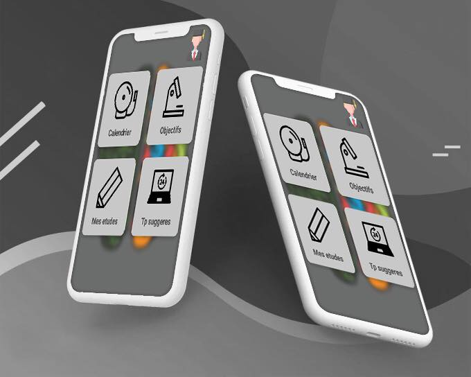

**Note** : in this repository you will find only the java & XML files, so in order to get this code to work, copy this folder in `your_Project/App/` along with your build folder

**Side Note** : This Project was done in 2019, and I lost a lot of data (screenshots and videos), but it has alot of features like video player, pdf reader...etc. Download the code and have fun with it :)

### App Screenshots
#### Login / Signup

|sign up| login |
|--|--|
|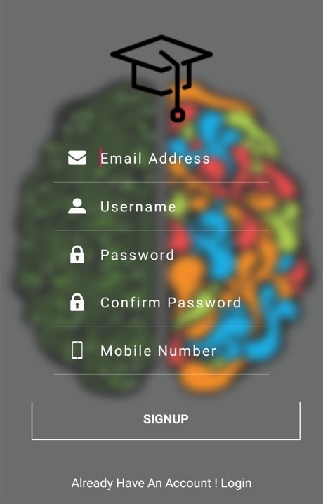 | 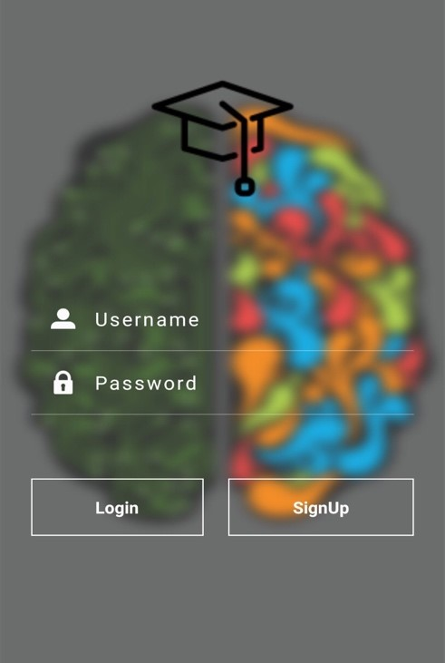  |

#### Home page

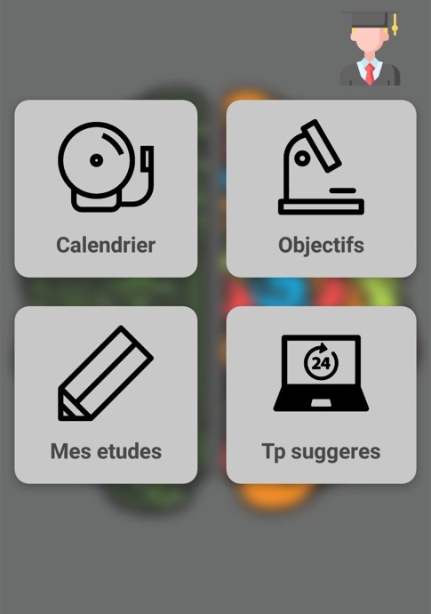

#### Main Screens
|Choose your language |Choose your teacher| Choose to study or take a tests|
|--|--|--|
|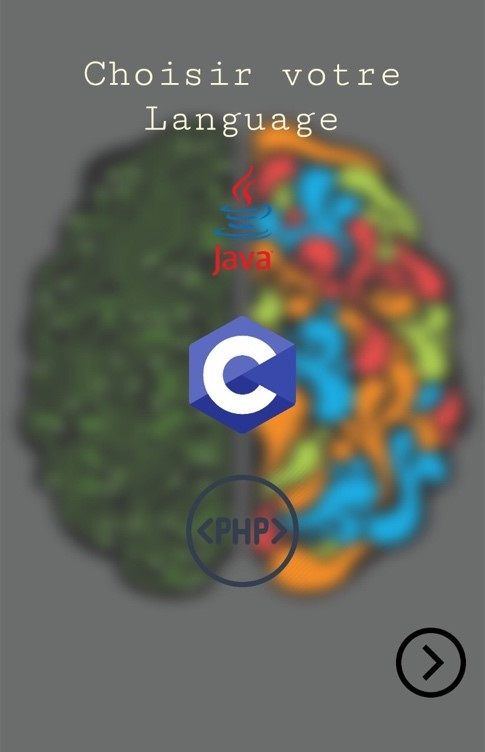 |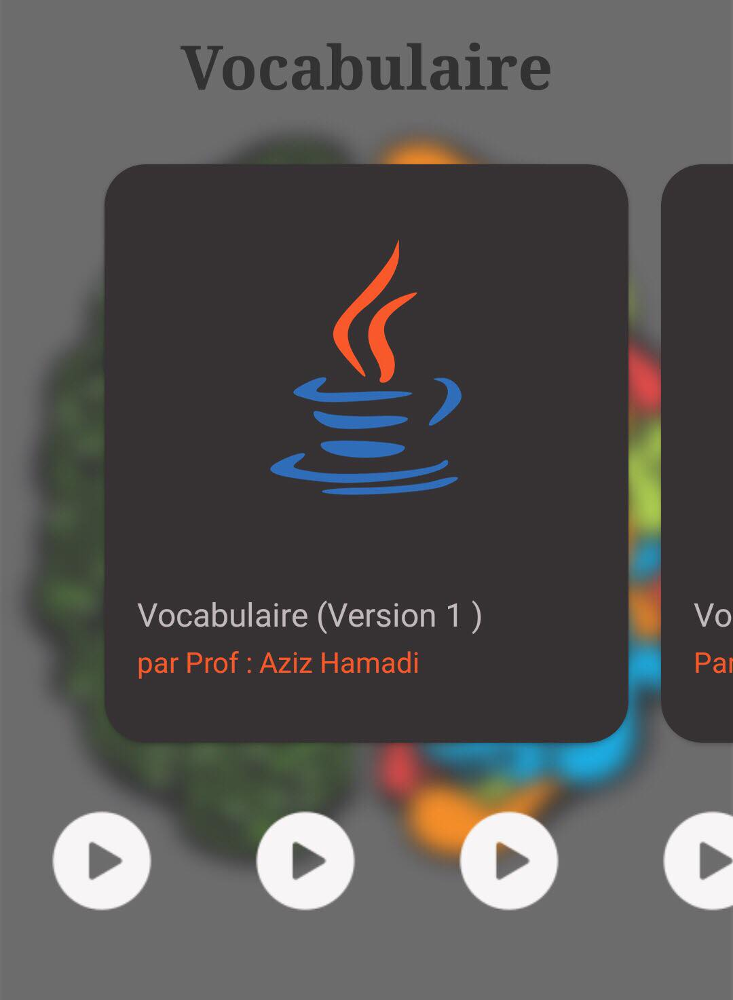|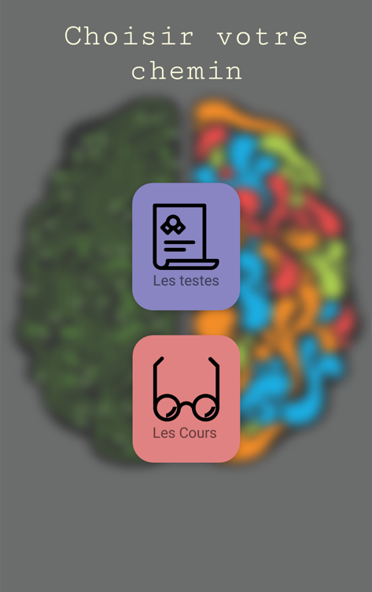|

* It's "Choisissez votre language" my bad  

#### Tests Screenshots
|C |Java| PHP|
|--|--|--|
|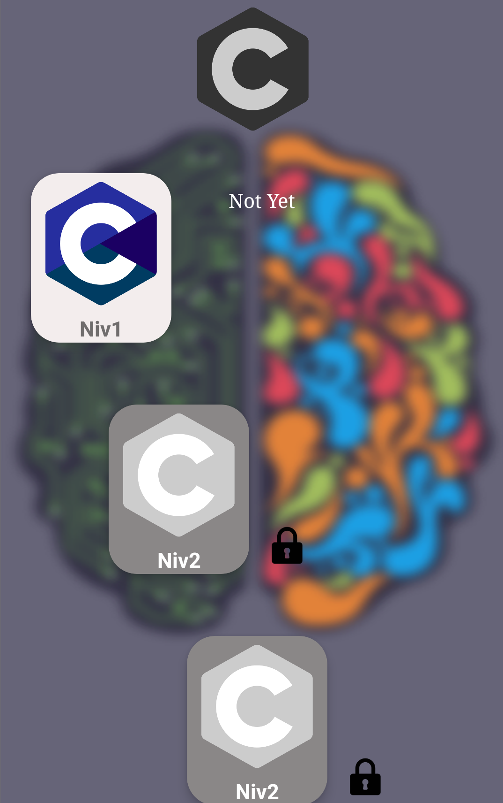|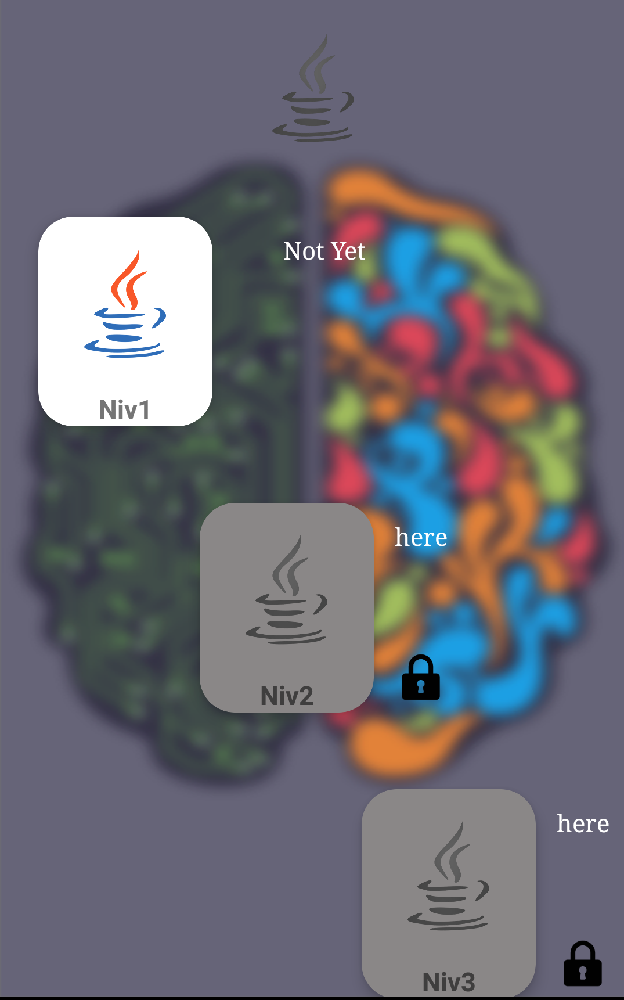|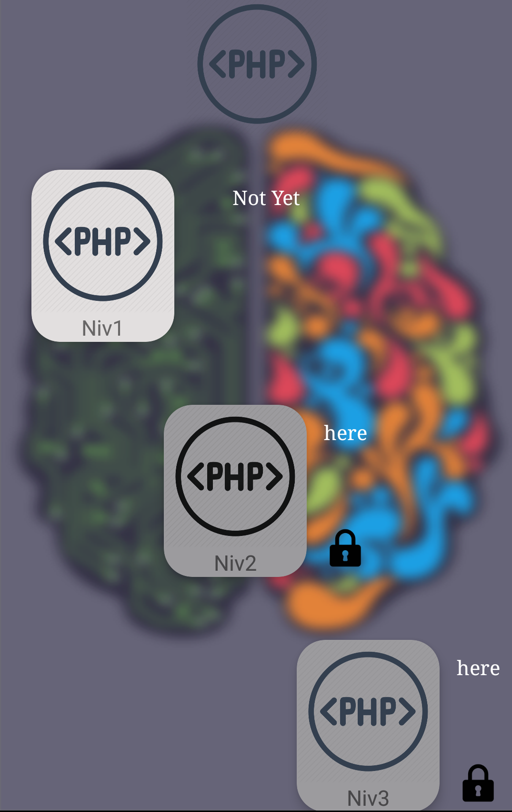|

#### Split screen scroll preview

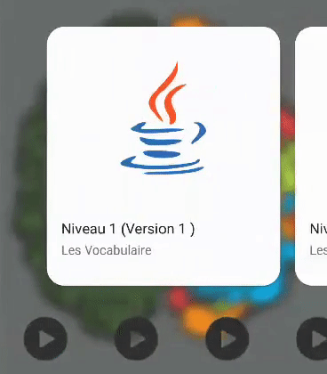|
